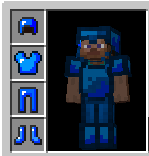
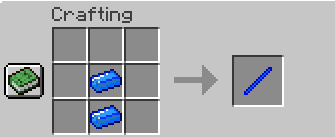

#Odyrite

##Informations
The Odyrite is a mineral that is stronger than Netherite
You need to cook the ore to get an ingot

##Amors
You can craft an Odyrite armor like an simple armor
Stats :
- Durability : 650
- Knockback resistance : 1.5
- Toughness : 3

You can repear this armor with Odyrite ingot

##Tools
With Odyrite, you can craft tools
* Sword
  * Harvest Level : 5
  * Efficiency :20
  * Enchantability : 20
  * Attack Speed : 1.5
  * Damage : 10
  * Durability : 2,501

For Craft this word, you don't need a stick, but an odyrite stik

**⚠️ You can use the Odyrite Stick just with for craft the Odyrite sword**

* Hoe
  * Harvest Level : 5
  * Efficiency : 10
  * Enchantability : 20
  * Attack Speed : 1.3
  * Damage : 5.5
  * Durability : 2,500
  

* Axe
    * Harvest Level : 5
    * Efficiency : 15
    * Enchantability : 20
    * Attack Speed : 1.3
    * Damage : 5.5
    * Durability : 2,500

* Pickaxe
    * Harvest Level : 5
    * Efficiency : 15
    * Enchantability : 20
    * Attack Speed : 1.3
    * Damage : 5.5
    * Durability : 2,500
  

* Hammer !!
    * Harvest Level : 5
    * Efficiency : 10
    * Enchantability : 5
    * Attack Speed : 1.3
    * Damage : 4
    * Durability : 1,500
  
*With the hammer you can mine a 3x3 hole*

***You can Repear all tools with odyrite ingot***

##Block
You can craft an Odyrite block like a gold block.
